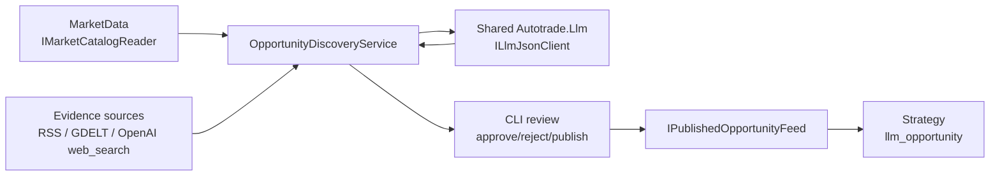

# OpportunityDiscovery Bounded Context

OpportunityDiscovery 负责自主扫描 Polymarket 市场和外部公开信息源，产出可审计的市场机会与 paper-only 策略定义。LLM 只参与离线研究和结构化 JSON 草案生成，不进入 Strategy 热路径；交易执行仍由现有 Strategy、Trading、Risk 管线负责。

详细设计见：

- [docs/module_opportunitydiscovery.md](../../docs/module_opportunitydiscovery.md)

## 架构概览

```text
OpportunityDiscovery/
├── Autotrade.OpportunityDiscovery.Domain.Shared/
│   └── Enums/                         # run/opportunity/review/evidence 状态枚举
├── Autotrade.OpportunityDiscovery.Domain/
│   └── Entities/                      # ResearchRun / EvidenceItem / MarketOpportunity / OpportunityReview
├── Autotrade.OpportunityDiscovery.Application.Contract/
│   ├── OpportunityDiscoveryContracts.cs
│   └── Analysis/                      # LLM analysis document contract
├── Autotrade.OpportunityDiscovery.Application/
│   ├── OpportunityDiscoveryService.cs # scan/review/publish/expire 主流程
│   ├── OpportunityQueryService.cs     # query + published feed
│   ├── OpportunityDiscoveryOptions.cs
│   ├── Evidence/                      # IEvidenceSource + normalized evidence
│   └── Repositories.cs
├── Autotrade.OpportunityDiscovery.Infra.Data/
│   ├── Context/                       # EF Core context
│   ├── Repositories/                  # repository implementations
│   ├── Migrations/                    # OpportunityDiscovery migrations
│   └── Design/                        # design-time DbContext factory
├── Autotrade.OpportunityDiscovery.Infra.Sources/
│   ├── GdeltDocApiSource.cs
│   ├── RssFeedSource.cs
│   └── OpenAiWebSearchSource.cs
├── Autotrade.OpportunityDiscovery.Infra.BackgroundJobs/
│   └── Jobs/                          # market scan / evidence refresh / expiration
├── Autotrade.OpportunityDiscovery.Infra.CrossCutting.IoC/
│   └── service registration
└── Autotrade.OpportunityDiscovery.Tests/
    └── unit/integration-style tests with fakes
```

## 核心流程



流程：

1. `OpportunityDiscoveryService.ScanAsync()` 从 `IMarketCatalogReader` 读取 active/liquid markets。
2. 通过 `IEvidenceSource` 拉取 RSS、GDELT、OpenAI web search 证据。
3. 对证据做 freshness filter、URL/hash 去重和 normalized persistence。
4. 调用共享 `ILlmJsonClient` 生成 `OpportunityAnalysisResponse`。
5. 应用层验证 market/evidence/probability/edge/policy。
6. 生成 `MarketOpportunity`，状态为 `Candidate` 或 `NeedsReview`。
7. 人工通过 CLI approve/reject/publish。
8. `LlmOpportunityStrategy` 只读取 `Published` 且未过期的机会。

## 领域对象

### ResearchRun

一次扫描研究任务，记录触发来源、市场 universe、状态、证据数量、机会数量和错误信息。

状态：

- `Pending`
- `Running`
- `Succeeded`
- `Failed`

### EvidenceItem

归一化证据，包含 source kind/name、URL、标题、摘要、发布时间、观察时间、content hash、raw JSON、source quality。

去重规则：

- scan 内按 normalized URL 去重。
- persistence 层按 `(ResearchRunId, ContentHash)` 去重。

### MarketOpportunity

LLM analysis document 经验证后生成的机会实体。

状态：

- `Candidate`
- `NeedsReview`
- `Approved`
- `Rejected`
- `Published`
- `Expired`

关键字段：

- `EvidenceIdsJson`
- `LlmOutputJson`
- `ScoreJson`
- `CompiledPolicyJson`
- `ValidUntilUtc`

### OpportunityReview

审核记录，保存 actor、decision、notes 和时间。

## Application Contracts

主要接口：

```csharp
public interface IOpportunityDiscoveryService
{
    Task<OpportunityScanResult> ScanAsync(OpportunityScanRequest request, CancellationToken cancellationToken = default);
    Task<MarketOpportunityDto> ApproveAsync(OpportunityReviewRequest request, CancellationToken cancellationToken = default);
    Task<MarketOpportunityDto> RejectAsync(OpportunityReviewRequest request, CancellationToken cancellationToken = default);
    Task<MarketOpportunityDto> PublishAsync(OpportunityReviewRequest request, CancellationToken cancellationToken = default);
    Task<int> ExpireStaleAsync(CancellationToken cancellationToken = default);
}

public interface IOpportunityQueryService
{
    Task<IReadOnlyList<MarketOpportunityDto>> ListOpportunitiesAsync(OpportunityStatus? status, int limit = 50, CancellationToken cancellationToken = default);
    Task<MarketOpportunityDto?> GetOpportunityAsync(Guid opportunityId, CancellationToken cancellationToken = default);
    Task<IReadOnlyList<EvidenceItemDto>> GetEvidenceAsync(Guid opportunityId, CancellationToken cancellationToken = default);
}

public interface IPublishedOpportunityFeed
{
    Task<IReadOnlyList<PublishedOpportunityDto>> GetPublishedAsync(CancellationToken cancellationToken = default);
}
```

## LLM 合约

LLM 输出必须反序列化为 `OpportunityAnalysisResponse`：

```text
OpportunityAnalysisResponse
  opportunities[]
    marketId
    outcome
    fairProbability
    confidence
    edge
    reason
    evidenceIds[]
    entryMaxPrice
    takeProfitPrice
    stopLossPrice
    maxSpread
    quantity
    maxNotional
    validUntilUtc
    abstainReason
  abstainReason
```

LLM 只允许生成可验证 JSON，不允许生成交易代码或执行指令。

## Strategy 桥接

Strategy id：

```text
llm_opportunity
```

实现位置：

```text
context/Strategy/Autotrade.Strategy.Application/Strategies/Opportunity/
```

约束：

- 默认 disabled/stopped。
- `SelectMarketsAsync` 只读取 published feed。
- `EvaluateEntryAsync` / `EvaluateExitAsync` 只使用 compiled policy 和 order book。
- 热路径不调用 LLM、不联网、不读取 evidence source。
- signal `ContextJson` 包含 `opportunityId`、`researchRunId`、`evidenceIds`、`edge` 等追踪信息。

## 数据库

EF Core context：

```text
OpportunityDiscoveryContext
```

Migration history table：

```text
__EFMigrationsHistory_OpportunityDiscovery
```

表：

- `OpportunityResearchRuns`
- `OpportunityEvidenceItems`
- `MarketOpportunities`
- `OpportunityReviews`

JSON 字段使用 PostgreSQL `jsonb`：

- market universe
- raw source payload
- LLM output
- score
- compiled policy

## CLI

命令：

```powershell
dotnet run --project Autotrade.Cli -- opportunity scan
dotnet run --project Autotrade.Cli -- opportunity list
dotnet run --project Autotrade.Cli -- opportunity show --id <opportunity-id>
dotnet run --project Autotrade.Cli -- opportunity approve --id <opportunity-id> --actor <actor>
dotnet run --project Autotrade.Cli -- opportunity reject --id <opportunity-id> --actor <actor>
dotnet run --project Autotrade.Cli -- opportunity publish --id <opportunity-id> --actor <actor>
```

审核类命令会走 destructive confirmation。非交互执行时需要显式 `--yes`。

## Background Jobs

Hangfire recurring jobs：

- `opportunity-market-scan`
- `opportunity-evidence-refresh`
- `opportunity-expiration`

配置路径：

```text
BackgroundJobs:OpportunityMarketScan
BackgroundJobs:OpportunityEvidenceRefresh
BackgroundJobs:OpportunityExpiration
```

默认 market scan/evidence refresh 关闭，expiration 开启。

## 配置

主要配置 section：

```json
{
  "OpportunityDiscovery": {
    "Enabled": false,
    "PaperOnly": true,
    "MinEdge": 0.03,
    "MinConfidence": 0.55,
    "FreshEvidenceMaxAgeHours": 72,
    "MaxEvidencePerMarket": 8,
    "DefaultValidHours": 24,
    "MaxMarketsPerScan": 20,
    "Llm": {
      "Provider": "OpenAICompatible",
      "Model": "gpt-4.1-mini",
      "BaseUrl": "",
      "ApiKeyEnvVar": "OPENAI_API_KEY",
      "TimeoutSeconds": 120,
      "MaxRetries": 3
    },
    "Rss": {
      "Enabled": false,
      "FeedUrls": [],
      "MaxItemsPerFeed": 25
    },
    "Gdelt": {
      "Enabled": true,
      "BaseUrl": "https://api.gdeltproject.org/api/v2/doc/doc",
      "MaxRecords": 10
    },
    "OpenAiWebSearch": {
      "Enabled": false,
      "BaseUrl": "",
      "ApiKeyEnvVar": "OPENAI_API_KEY",
      "Model": "gpt-4.1-mini",
      "MaxResults": 5
    }
  }
}
```

密钥规则：

- API key 不提交到仓库。
- 使用环境变量、user secrets 或本地 `.env`。
- MVP 强制 `PaperOnly=true`。

## 测试

运行：

```powershell
dotnet test context/OpportunityDiscovery/Autotrade.OpportunityDiscovery.Tests
dotnet test Shared/Autotrade.Llm.Tests
dotnet test context/Strategy/Autotrade.Strategy.Tests
```

全量验证：

```powershell
dotnet restore
dotnet build
dotnet test
```

测试覆盖：

- domain invariant/status transition
- evidence source parser
- evidence dedup
- fake market catalog + fake evidence + fake LLM scan
- review/publish guard
- published feed policy roundtrip
- strategy published-only selection and deterministic entry/exit

## 安全边界

OpportunityDiscovery 是研究和策略定义模块，不是执行模块。

必须保持：

- LLM 不下单。
- LLM 不生成可执行交易策略代码。
- 未审核机会不进入 strategy feed。
- 过期机会不进入 strategy feed。
- Strategy 热路径无 LLM、无网络、无外部 source。
- Live/canary/auto-apply 不属于 MVP。
