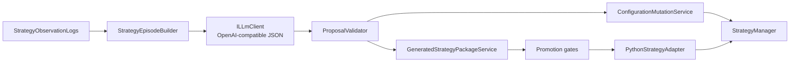

# SelfImprove Bounded Context

SelfImprove 负责为 Autotrade 提供系统级自我改进外循环：基于结构化策略观测构造 episode，调用 OpenAI-compatible LLM 生成 typed proposal，并将参数补丁或 generated strategy 版本纳入可验证、可审计、可回滚的晋级流程。

SelfImprove 不在线训练模型权重，不让 LLM 直接下单，也不让生成的 Python 策略接触 API key、私钥或执行服务。所有交易 intent 仍回到 C# Strategy / Risk / Trading 主干处理。

详细设计见：

- [docs/module_selfimprove.md](../../docs/module_selfimprove.md)

## 架构概览

```text
SelfImprove/
|-- Autotrade.SelfImprove.Domain.Shared/
|   `-- Enums/                              # run/proposal/generated strategy/gate 状态枚举
|-- Autotrade.SelfImprove.Domain/
|   `-- Entities/                           # ImprovementRun / Episode / Proposal / Patch / GeneratedVersion
|-- Autotrade.SelfImprove.Application.Contract/
|   |-- SelfImproveContracts.cs             # ISelfImproveService + run/apply DTO
|   |-- Episodes/                           # BuildStrategyEpisodeRequest / StrategyEpisodeDto
|   |-- Proposals/                          # ImprovementProposalDocument / ParameterPatchSpec
|   |-- GeneratedStrategies/                # GeneratedStrategyManifest / gate DTO
|   `-- Llm/                                # ILLmClient contract
|-- Autotrade.SelfImprove.Application/
|   |-- SelfImproveService.cs               # 主流程编排
|   |-- SelfImproveOptions.cs               # SelfImprove 配置
|   |-- Episodes/                           # episode 构造与 mapper
|   |-- Llm/                                # OpenAI-compatible client + .env reader
|   |-- Proposals/                          # proposal validation / mapper
|   |-- GeneratedStrategies/                # immutable package / dynamic registration
|   `-- Python/                             # out-of-process Python strategy runtime
|-- Autotrade.SelfImprove.Infra.Data/
|   |-- Context/                            # SelfImproveContext
|   |-- Repositories/                       # EF repository implementations
|   |-- Migrations/                         # SelfImprove migrations
|   `-- Design/                             # design-time DbContext factory
|-- Autotrade.SelfImprove.Infra.BackgroundJobs/
|   `-- Jobs/                               # scheduled analysis jobs
|-- Autotrade.SelfImprove.Infra.CrossCutting.IoC/
|   `-- SelfImproveServiceCollectionExtensions.cs
`-- Autotrade.SelfImprove.Tests/
    |-- Configuration/
    |-- Llm/
    `-- Proposals/
```

## 核心流程



流程说明：

1. Strategy 热路径写入 `StrategyObservation`，记录 select、entry、exit、order update、risk/execution rejection、timeout、kill switch 等结构化事实。
2. `StrategyEpisodeBuilder` 按 strategy、market、config version、时间窗口聚合 decisions、observations、orders、trades、risk events 和 KPI。
3. `OpenAiCompatibleLlmClient` 把 episode、`StrategyMemory`、`ImprovementPlaybook` 发送给 LLM，要求返回 typed JSON。
4. `ProposalValidator` 校验 evidence、risk level、rollback conditions、参数补丁和 generated strategy spec。
5. 参数建议进入 `ConfigurationMutationService`，默认 dry-run，通过白名单、类型和合规校验后才能 apply。
6. 代码生成建议进入 immutable strategy package，生成 manifest、Python module、schema、unit tests、replay spec、risk envelope 和 hash。
7. generated strategy 只能按状态机逐级晋级，Live 只允许进入 canary。

## 领域对象

### ImprovementRun

一次 SelfImprove 分析运行，记录 strategy、market、窗口、触发来源、状态、episode id、proposal 数量和错误信息。

状态：

- `Pending`
- `Running`
- `Analyzed`
- `Completed`
- `ManualReview`
- `Failed`

### StrategyEpisode

策略分析样本。由多个上下文的事实聚合而来，包含：

- decision / observation / order / trade / risk event count
- net PnL
- fill rate
- reject rate
- timeout rate
- max open exposure
- drawdown-like metric
- source ids JSON
- metrics JSON

### StrategyMemory

typed durable memory，不使用 Markdown skill 作为交易运行依据。

包含：

- `MemoryJson`
- `PlaybookJson`

### ImprovementProposal

LLM 输出经校验后的建议。建议必须带 evidence、风险等级、预期影响和回滚条件。

类型：

- `ParameterPatch`
- `GeneratedStrategy`
- `ManualReview`

状态：

- `Proposed`
- `ManualReview`
- `Approved`
- `Applied`
- `Rejected`

### ParameterPatch / PatchOutcome

参数补丁和执行结果。所有补丁必须通过共享配置变更服务，保留 diff 和 rollback JSON。

### GeneratedStrategyVersion

LLM 生成策略包的版本记录。保存 artifact root、package hash、manifest、risk envelope、validation summary、canary 状态和隔离原因。

### PromotionGateResult

generated strategy 每个晋级阶段的 gate 结果，包含 passed、message 和 evidence JSON。

## Application Contracts

主服务接口：

```csharp
public interface ISelfImproveService
{
    Task<SelfImproveRunResult> RunAsync(
        BuildStrategyEpisodeRequest request,
        string trigger,
        CancellationToken cancellationToken = default);

    Task<IReadOnlyList<ImprovementRunDto>> ListRunsAsync(
        int limit = 50,
        CancellationToken cancellationToken = default);

    Task<SelfImproveRunResult?> GetRunAsync(
        Guid runId,
        CancellationToken cancellationToken = default);

    Task<PatchOutcomeDto> ApplyProposalAsync(
        ApplyProposalRequest request,
        CancellationToken cancellationToken = default);

    Task<GeneratedStrategyVersionDto> PromoteGeneratedStrategyAsync(
        Guid generatedStrategyVersionId,
        GeneratedStrategyStage targetStage,
        CancellationToken cancellationToken = default);

    Task<GeneratedStrategyVersionDto> RollbackGeneratedStrategyAsync(
        Guid generatedStrategyVersionId,
        CancellationToken cancellationToken = default);

    Task<GeneratedStrategyVersionDto> QuarantineGeneratedStrategyAsync(
        Guid generatedStrategyVersionId,
        string reason,
        CancellationToken cancellationToken = default);
}
```

Episode 请求：

```csharp
public sealed record BuildStrategyEpisodeRequest(
    string StrategyId,
    string? MarketId,
    DateTimeOffset WindowStartUtc,
    DateTimeOffset WindowEndUtc,
    int Limit = 5000);
```

LLM proposal：

```csharp
public sealed record ImprovementProposalDocument(
    ProposalKind Kind,
    ImprovementRiskLevel RiskLevel,
    string Title,
    string Rationale,
    IReadOnlyList<EvidenceRef> Evidence,
    string ExpectedImpact,
    IReadOnlyList<string> RollbackConditions,
    IReadOnlyList<ParameterPatchSpec> ParameterPatches,
    GeneratedStrategySpec? GeneratedStrategy);
```

## LLM 合约

LLM 接口只允许返回 typed JSON，不允许返回自由文本操作指令。

```csharp
public interface ILLmClient
{
    Task<IReadOnlyList<ImprovementProposalDocument>> AnalyzeEpisodeAsync(
        StrategyEpisodeAnalysisRequest request,
        CancellationToken cancellationToken = default);

    Task<GeneratedStrategySpec> GenerateStrategyAsync(
        ImprovementProposalDocument proposal,
        StrategyEpisodeDto episode,
        CancellationToken cancellationToken = default);
}
```

`OpenAiCompatibleLlmClient` 支持：

- OpenAI-compatible `/chat/completions`
- JSON schema response format
- `.env` 和环境变量 API key
- retry / timeout
- `<think>` 块剥离
- JSON object extraction

无 evidence、malformed JSON、unsafe patch path、过大参数变化和缺文件 generated strategy 都不能自动应用。

## Python Strategy Runtime

生成策略通过 `PythonStrategyAdapter : ITradingStrategy` 接入 Strategy 主干，Python worker 进程只接收脱敏后的 market/order/risk snapshot，只返回 action、reason、order intents、telemetry 和 state patch。

Python output contract：

```csharp
public sealed record PythonStrategyResponse(
    string Action,
    string ReasonCode,
    string Reason,
    IReadOnlyList<PythonOrderIntent> Intents,
    IReadOnlyDictionary<string, object?> Telemetry,
    IReadOnlyDictionary<string, object?> StatePatch);
```

允许 action：

- `skip`
- `enter`
- `exit`
- `cancel`
- `replace`

禁止行为：

- 读取 API key、私钥或真实凭据
- 直接调用交易 API
- 绕过 C# RiskManager
- 绕过 C# ExecutionService
- 修改 kill switch、live arming、execution mode

## Generated Strategy 晋级状态机

```text
Generated
  -> StaticValidated
  -> UnitTested
  -> ReplayValidated
  -> ShadowRunning
  -> PaperRunning
  -> LiveCanary
  -> Promoted
```

失败状态：

- `RolledBack`
- `Quarantined`

规则：

- 禁止跳级。
- 每个阶段写 `PromotionGateResult`。
- LiveCanary 需要显式开启 `SelfImprove:LiveAutoApplyEnabled=true`。
- 默认只允许一个 active LiveCanary。
- LiveCanary 必须受单笔、单周期、总名义金额硬限额约束。

## 数据持久化

SelfImprove 使用独立 EF Core context：

```text
SelfImproveContext
```

迁移历史表：

```text
__EFMigrationsHistory_SelfImprove
```

业务表：

| Table | Purpose |
| --- | --- |
| `ImprovementRuns` | self-improve run |
| `StrategyEpisodes` | 聚合后的策略分析样本 |
| `StrategyMemories` | typed durable memory 和 playbook |
| `ImprovementProposals` | LLM proposal |
| `ParameterPatches` | 参数补丁 |
| `PatchOutcomes` | dry-run/apply 结果 |
| `GeneratedStrategyVersions` | generated strategy artifact 元数据 |
| `PromotionGateResults` | generated strategy gate evidence |

Strategy context 同时提供：

| Table | Purpose |
| --- | --- |
| `StrategyObservationLogs` | Strategy 热路径结构化观测 |

## API

路由前缀：

```text
/api/self-improve
```

接口：

| Method | Path | Description |
| --- | --- | --- |
| `GET` | `/runs?limit=50` | 查询最近 runs |
| `GET` | `/runs/{runId}` | 查询 run、episode、proposals |
| `POST` | `/runs` | 构造 episode 并运行 LLM 分析 |
| `POST` | `/proposals/{proposalId}/apply?dryRun=true` | dry-run 或应用参数补丁 |
| `POST` | `/generated/{generatedVersionId}/promote?stage=...` | 晋级 generated strategy |
| `POST` | `/generated/{generatedVersionId}/rollback` | 回滚 generated strategy |
| `POST` | `/generated/{generatedVersionId}/quarantine` | 隔离 generated strategy |

## CLI

```text
autotrade self-improve run
autotrade self-improve list
autotrade self-improve show
autotrade self-improve apply
autotrade self-improve promote
autotrade self-improve rollback
autotrade self-improve quarantine
```

示例：

```text
autotrade self-improve run --strategy-id dual_leg --window-minutes 120
autotrade self-improve list --limit 20
autotrade self-improve show --run-id <runId>
autotrade self-improve apply --proposal-id <proposalId> --dry-run true
autotrade self-improve promote --generated-version-id <id> --stage PaperRunning
autotrade self-improve quarantine --generated-version-id <id> --reason "failed replay"
```

## 配置

默认关闭：

```json
{
  "SelfImprove": {
    "Enabled": false,
    "LiveAutoApplyEnabled": false,
    "ArtifactRoot": "artifacts/self-improve",
    "Llm": {
      "Provider": "OpenAICompatible",
      "Model": "gpt-4.1-mini",
      "BaseUrl": null,
      "ApiKeyEnvVar": "OPENAI_API_KEY",
      "TimeoutSeconds": 120,
      "MaxRetries": 3
    },
    "CodeGen": {
      "Enabled": true,
      "PythonExecutable": "python",
      "WorkerTimeoutSeconds": 5
    },
    "Canary": {
      "MaxActiveLiveCanaries": 1,
      "MaxSingleOrderNotional": 5,
      "MaxCycleNotional": 20,
      "MaxTotalNotional": 100
    }
  }
}
```

API key 通过 `.env` 或环境变量读取，变量名由 `SelfImprove:Llm:ApiKeyEnvVar` 指定。不要把真实密钥提交到源码或 appsettings。

## 开发与测试

常用命令：

```text
dotnet build --no-restore
dotnet test --no-build
```

SelfImprove 相关测试位于：

```text
context/SelfImprove/Autotrade.SelfImprove.Tests/
```

当前覆盖：

- proposal validation
- OpenAI-compatible JSON parsing
- malformed JSON
- `<think>` 块剥离
- unsafe config path
- configuration mutation dry-run / apply

Postgres smoke tests 继续使用仓库约定：

```text
AUTOTRADE_TEST_POSTGRES
```

## 安全边界

SelfImprove 的生产默认策略：

- `SelfImprove:Enabled=false`
- `SelfImprove:LiveAutoApplyEnabled=false`
- 参数补丁默认 dry-run
- generated strategy 默认不能进入 LiveCanary
- LiveCanary 必须人工明确打开

上线建议：

1. 先只开启 Strategy observation。
2. 在 Paper 环境开启 SelfImprove run/list/show。
3. 对低风险 proposal 运行 dry-run。
4. 人工审核后再 apply。
5. generated strategy 先只允许到 replay/shadow/paper。
6. LiveCanary 一次只允许一个 generated strategy。
