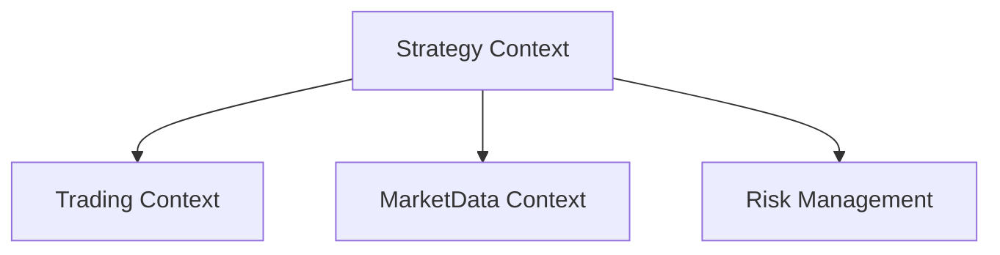

# Strategy Bounded Context

Strategy 限界上下文负责交易策略的定义、执行和生命周期管理。

## 架构概览

```
Strategy/
├── Autotrade.Strategy.Application/            # 应用服务层
│   └── StrategyManager/                       # 策略管理器 (待实现)
├── Autotrade.Strategy.Application.Contract/   # 契约层
│   ├── ITradingStrategy.cs                   # 交易策略接口
│   └── StrategyContext.cs                    # 策略上下文
├── Autotrade.Strategy.Domain/                 # 领域层
│   └── Entities/                              # 策略相关实体
├── Autotrade.Strategy.Infra.Data/             # 数据持久化
├── Autotrade.Strategy.Infra.CrossCutting.IoC/ # 依赖注入
└── Autotrade.Strategy.Tests/                  # 单元测试
```

## 计划中的核心组件

### 1. 交易策略接口 (`ITradingStrategy`)

```csharp
public interface ITradingStrategy
{
    string Id { get; }
    string Name { get; }

    Task<IEnumerable<string>> SelectMarketsAsync(CancellationToken ct);
    Task<EntrySignal?> EvaluateEntryAsync(MarketData data, CancellationToken ct);
    Task<ExitSignal?> EvaluateExitAsync(Position position, CancellationToken ct);
    Task OnOrderUpdateAsync(OrderUpdate update, CancellationToken ct);

    Task StartAsync(CancellationToken ct);
    Task PauseAsync(CancellationToken ct);
    Task StopAsync(CancellationToken ct);
}
```

### 2. 策略管理器 (`StrategyManager`)

- 策略注册和工厂
- 生命周期管理 (Running/Paused/Stopped/Faulted)
- 数据路由和背压控制
- 错误隔离和重启策略

### 3. 计划支持的策略

| 策略                  | 说明                   | 状态            |
| --------------------- | ---------------------- | --------------- |
| DualLegArbitrage      | 同市场 Yes/No 双腿套利 | Task 7 (待实现) |
| RepricingLagArbitrage | 现货确认重定价延迟套利 | 设计中          |

## 依赖关系



## 策略状态机

```
Created → Running → Paused → Running
                  ↘ Stopped
                  ↘ Faulted → (manual restart)
```

## 配置

```json
{
  "Strategy": {
    "Enabled": true,
    "MaxConcurrentStrategies": 3,
    "DecisionLogEnabled": true
  },
  "Strategies": {
    "DualLegArbitrage": {
      "Enabled": false,
      "PairCostThreshold": 0.98,
      "MinLiquidity": 1000,
      "MaxUnhedgedCapitalPerMarket": 0.02
    }
  }
}
```

## 开发状态

- ✅ Task 1: 基础设施和领域模型
- ✅ Task 2: Polymarket API 客户端
- ✅ Task 3: WebSocket 市场数据
- ✅ Task 4: 执行引擎
- ⏳ Task 5: 风险管理模块
- ⏳ Task 6: 策略引擎和生命周期
- ⏳ Task 7: 双腿套利策略

## 待实现

此上下文的核心功能（StrategyManager、ITradingStrategy 实现）将在 Task 6 和 Task 7 中完成。当前仅包含基础项目结构。
