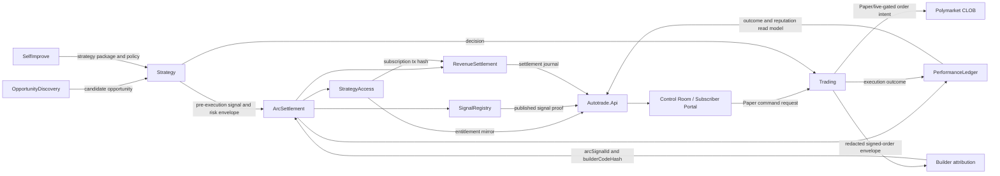

# ProofAlpha Arc Hackathon Architecture

## Boundary Notes

- `OpportunityDiscovery`, `SelfImprove`, `Strategy`, and `Trading` stay in their
  bounded contexts.
- `ArcSettlement` owns proof, access, performance, and revenue contracts plus
  local journals.
- `Autotrade.Api` exposes read models and command endpoints to the Control Room.
- Polymarket remains the venue; Arc records proof and settlement evidence around
  the agent product.
- Paper execution is the default demo path. Live execution remains separately
  armed and risk-gated.
