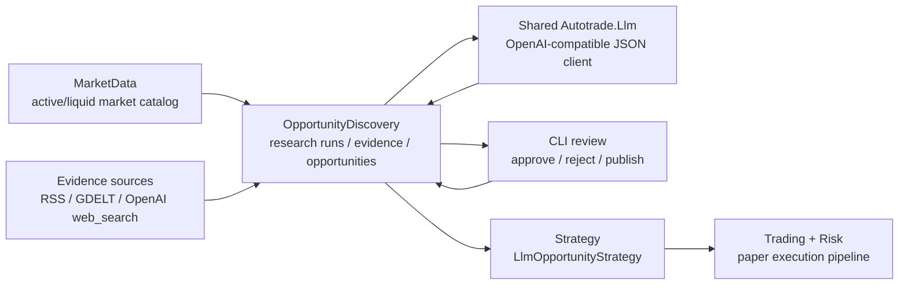
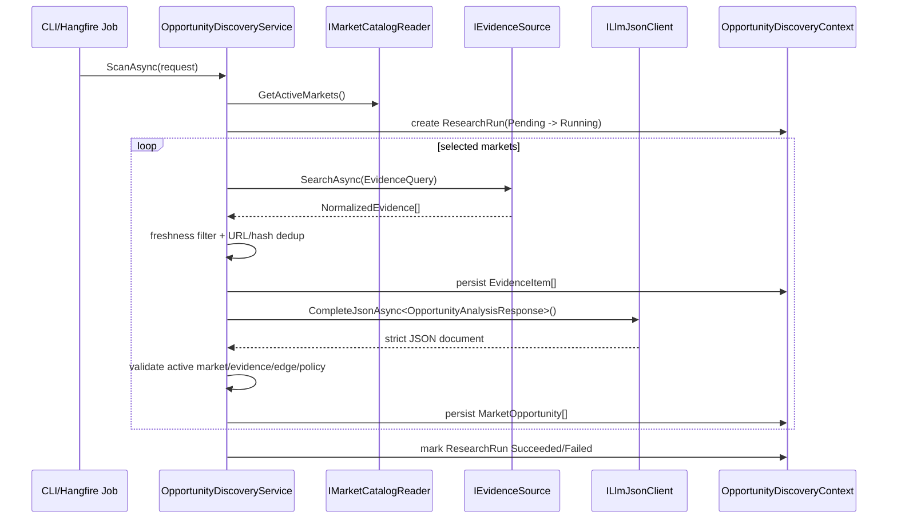

# OpportunityDiscovery 模块设计

本文档描述 Autotrade 的 `OpportunityDiscovery` bounded context。该模块负责离线扫描 Polymarket 市场和外部公开信息源，形成可审计的市场机会与 paper-only 策略定义。LLM 只参与研究和结构化策略草案生成，不进入 `StrategyRunner` 热路径；实际交易决策仍由 Strategy/Trading/Risk 管线 deterministic 执行。

---

## 1. 设计目标

`OpportunityDiscovery` 的目标是让系统具备自主发现市场机会的能力，同时把 LLM、互联网扫描和交易执行彻底解耦。

核心原则：

- LLM 不直接下单，不调用交易 API，不生成可执行 C# 或 Python 策略代码。
- LLM 输出必须落到严格 JSON contract，并经过应用层验证后才能进入人工审核流。
- 所有机会必须可追踪到 `ResearchRun`、evidence URL/hash、LLM raw output、score 和 compiled policy。
- MVP 只允许 Paper execution；Live/canary/auto-apply 不在本模块闭环内。
- Strategy 热路径只读取 `Published` 且未过期的机会，不联网、不调用 LLM。
- 任何证据不足、schema 不合法、市场不可交易、edge 不足或机会过期的结果都不能发布。

---

## 2. 模块边界

`OpportunityDiscovery` 位于 `context/OpportunityDiscovery`，与现有 bounded contexts 的关系如下：



允许读取：

- `IMarketCatalogReader.GetActiveMarkets()` 的市场 universe。
- 配置启用的信息源：RSS、GDELT、OpenAI Responses API `web_search`。
- 本 context 内的 research run、evidence、opportunity、review 数据。

允许写入：

- `ResearchRun`
- `EvidenceItem`
- `MarketOpportunity`
- `OpportunityReview`

不允许：

- 直接调用 `ExecutionService` 或 `RiskManager`。
- 修改 Strategy/Trading 配置。
- 在 Strategy evaluation 中触发 LLM 或网络访问。
- 将未审核或已过期的机会暴露给策略。

---

## 3. 项目结构

```text
Shared/
  Autotrade.Llm/
    ILlmJsonClient
    OpenAiCompatibleLlmJsonClient

context/OpportunityDiscovery/
  Autotrade.OpportunityDiscovery.Domain.Shared/
    Enums/
      ResearchRunStatus
      OpportunityStatus
      OpportunityReviewDecision
      OpportunityOutcomeSide
      EvidenceSourceKind

  Autotrade.OpportunityDiscovery.Domain/
    Entities/
      ResearchRun
      EvidenceItem
      MarketOpportunity
      OpportunityReview

  Autotrade.OpportunityDiscovery.Application.Contract/
    OpportunityDiscoveryContracts
    Analysis/OpportunityAnalysisContracts

  Autotrade.OpportunityDiscovery.Application/
    OpportunityDiscoveryService
    OpportunityQueryService
    OpportunityDiscoveryOptions
    Evidence/IEvidenceSource
    Repositories

  Autotrade.OpportunityDiscovery.Infra.Data/
    OpportunityDiscoveryContext
    Repositories
    Migrations

  Autotrade.OpportunityDiscovery.Infra.Sources/
    GdeltDocApiSource
    RssFeedSource
    OpenAiWebSearchSource

  Autotrade.OpportunityDiscovery.Infra.BackgroundJobs/
    OpportunityMarketScanJob
    OpportunityEvidenceRefreshJob
    OpportunityExpirationJob

  Autotrade.OpportunityDiscovery.Infra.CrossCutting.IoC/
    service registration
```

Strategy 桥接位于：

```text
context/Strategy/Autotrade.Strategy.Application/Strategies/Opportunity/
  LlmOpportunityStrategy
  LlmOpportunityOptions
```

CLI 入口位于：

```text
Autotrade.Cli/Commands/OpportunityCommands.cs
Autotrade.Cli/Program.cs
```

---

## 4. 领域模型

### ResearchRun

一次市场机会研究任务，记录触发来源、扫描市场 universe、状态、证据数量、机会数量和错误信息。

状态：

- `Pending`
- `Running`
- `Succeeded`
- `Failed`

关键约束：

- `Pending -> Running -> Succeeded`
- 失败时记录 `ErrorMessage`
- 成功时记录 evidence/opportunity count

### EvidenceItem

归一化后的外部证据。每条证据包含 source kind/name、URL、标题、摘要、发布时间、观察时间、content hash、raw JSON 和 source quality。

去重策略：

- scan 内先按 normalized URL 去重。
- repository 内按 `(ResearchRunId, ContentHash)` 去重。
- 不跨 research run 全局去重，避免后续机会引用未持久化的 evidence id。

### MarketOpportunity

LLM analysis document 经过验证和编译后的候选机会。

状态：

- `Candidate`
- `NeedsReview`
- `Approved`
- `Rejected`
- `Published`
- `Expired`

关键字段：

- `MarketId`
- `Outcome`
- `FairProbability`
- `Confidence`
- `Edge`
- `ValidUntilUtc`
- `EvidenceIdsJson`
- `LlmOutputJson`
- `ScoreJson`
- `CompiledPolicyJson`

状态规则：

- 初始状态只能是 `Candidate` 或 `NeedsReview`。
- 只有未过期机会可以 `Approve`。
- 只有 `Approved` 且未过期机会可以 `Publish`。
- `Rejected` 和 `Expired` 不再被 Strategy feed 读取。

### OpportunityReview

审核记录，保存 reviewer actor、decision、notes 和时间。MVP 通过 CLI 完成审核，不提供 Web UI。

---

## 5. 扫描与分析管线



市场选择：

- 从 `IMarketCatalogReader.GetActiveMarkets()` 读取。
- 要求至少 2 个 token id。
- 按 `MinVolume24h` / `MinLiquidity` 过滤。
- 按 24h volume、liquidity 降序取 `MaxMarketsPerScan`。

证据来源：

- `GdeltDocApiSource`
  - 默认启用。
  - 无 API key。
  - 查询公开 GDELT DOC API。
- `RssFeedSource`
  - 按配置启用。
  - feed URL 只来自本地配置。
  - 按市场名称拆出的关键词过滤。
- `OpenAiWebSearchSource`
  - 按配置启用。
  - API key 只从环境变量读取。
  - 使用 OpenAI Responses API `web_search` 工具，参考 [OpenAI Web Search docs](https://platform.openai.com/docs/guides/tools-web-search)。
  - 请求 `include = ["web_search_call.action.sources"]` 以拿到 sources。

---

## 6. LLM JSON 合约

共享 LLM 基础设施在 `Shared/Autotrade.Llm`：

```csharp
public interface ILlmJsonClient
{
    Task<LlmJsonResult<T>> CompleteJsonAsync<T>(
        LlmJsonRequest request,
        Func<T, IReadOnlyList<string>>? validator = null,
        CancellationToken cancellationToken = default)
        where T : class;
}
```

`OpenAiCompatibleLlmJsonClient` 负责：

- OpenAI-compatible chat/completions 请求。
- timeout。
- 429/5xx/transport/json retry。
- `<think>...</think>` 清理。
- JSON object 抽取。
- camelCase string enum 反序列化。
- `ILlmJsonValidatable` 与 app-level validator。
- API key 从环境变量或本地 `.env` 读取。

`OpportunityDiscovery` 的 LLM 输出 contract：

```text
OpportunityAnalysisResponse
  opportunities[]
    marketId
    outcome
    fairProbability
    confidence
    edge
    reason
    evidenceIds[]
    entryMaxPrice
    takeProfitPrice
    stopLossPrice
    maxSpread
    quantity
    maxNotional
    validUntilUtc
    abstainReason
  abstainReason
```

LLM prompt 规则：

- 只能使用当前 market 和 evidence。
- 每个非 abstain opportunity 必须引用 evidence id。
- 不得返回执行指令或代码。
- 证据弱或冲突时返回 no opportunities + abstain reason。

---

## 7. 验证与发布规则

应用层 validator 检查：

- `marketId` 必须匹配当前被分析市场。
- `fairProbability` 必须在 `0..1`。
- `confidence` 必须满足 `MinConfidence..1`。
- `edge` 必须满足 `MinEdge`。
- entry/take-profit/stop-loss 价格必须在 `0.01..0.99`。
- `stopLossPrice < entryMaxPrice < takeProfitPrice`。
- quantity 和 maxNotional 必须为正数。
- 至少引用 1 条 evidence。
- evidence id 必须来自本 run。
- valid-until 必须在未来。

处理结果：

- 验证全部通过：`Candidate`。
- 有错误但仍有 evidence：`NeedsReview`。
- 没有 evidence 或完全 abstain：不发布 opportunity。
- 只有 `Approved` 且未过期的 opportunity 可以 `Published`。

---

## 8. Strategy 桥接

`LlmOpportunityStrategy` 注册 id：

```text
llm_opportunity
```

默认配置：

```json
{
  "Strategies": {
    "LlmOpportunity": {
      "Enabled": false
    }
  },
  "StrategyEngine": {
    "DesiredStates": {
      "llm_opportunity": "Stopped"
    }
  }
}
```

行为：

- `SelectMarketsAsync`
  - 只读取 `IPublishedOpportunityFeed.GetPublishedAsync()`。
  - 过滤未过期机会。
  - 按 edge 降序选择市场。
- `EvaluateEntryAsync`
  - 使用 compiled policy 和 order book top-of-book。
  - 检查 quote freshness、max spread、entry max price、position/open-order/cooldown。
  - 生成 deterministic FOK limit buy signal。
- `EvaluateExitAsync`
  - 按 take-profit、stop-loss、opportunity expiry 触发 exit。
  - 生成 deterministic FOK limit sell signal。
- `ContextJson`
  - 写入 `opportunityId`、`researchRunId`、`evidenceIds`、`edge`、action、observed price、quantity。

热路径保证：

- 不调用 LLM。
- 不联网。
- 不读取 evidence source。
- 不读取未发布或已过期机会。

---

## 9. 数据库设计

`OpportunityDiscoveryContext` 独立注册，migration history table：

```text
__EFMigrationsHistory_OpportunityDiscovery
```

表：

- `OpportunityResearchRuns`
- `OpportunityEvidenceItems`
- `MarketOpportunities`
- `OpportunityReviews`

JSON 字段：

- `ResearchRun.MarketUniverseJson` -> `jsonb`
- `EvidenceItem.RawJson` -> `jsonb`
- `MarketOpportunity.EvidenceIdsJson` -> `jsonb`
- `MarketOpportunity.LlmOutputJson` -> `jsonb`
- `MarketOpportunity.ScoreJson` -> `jsonb`
- `MarketOpportunity.CompiledPolicyJson` -> `jsonb`

关键索引：

- `OpportunityResearchRuns(Status, CreatedAtUtc)`
- `OpportunityEvidenceItems(ResearchRunId)`
- `OpportunityEvidenceItems(ResearchRunId, ContentHash)` unique
- `MarketOpportunities(ResearchRunId)`
- `MarketOpportunities(Status, ValidUntilUtc)`
- `MarketOpportunities(MarketId, Status)`
- `OpportunityReviews(OpportunityId)`

---

## 10. CLI 与后台任务

CLI 命令：

```text
opportunity scan
opportunity list
opportunity show
opportunity approve
opportunity reject
opportunity publish
```

审核类命令复用 CLI destructive confirmation；非交互模式下需要显式 `--yes`。

Hangfire jobs：

- `OpportunityMarketScanJob`
  - recurring id: `opportunity-market-scan`
  - config: `BackgroundJobs:OpportunityMarketScan`
- `OpportunityEvidenceRefreshJob`
  - recurring id: `opportunity-evidence-refresh`
  - config: `BackgroundJobs:OpportunityEvidenceRefresh`
- `OpportunityExpirationJob`
  - recurring id: `opportunity-expiration`
  - config: `BackgroundJobs:OpportunityExpiration`

默认 scan/evidence refresh disabled，expiration enabled。

---

## 11. 配置与密钥

配置 section：

```json
{
  "OpportunityDiscovery": {
    "Enabled": false,
    "PaperOnly": true,
    "MinEdge": 0.03,
    "MinConfidence": 0.55,
    "FreshEvidenceMaxAgeHours": 72,
    "MaxEvidencePerMarket": 8,
    "DefaultValidHours": 24,
    "MaxMarketsPerScan": 20,
    "Llm": {
      "Provider": "OpenAICompatible",
      "Model": "gpt-4.1-mini",
      "BaseUrl": "",
      "ApiKeyEnvVar": "OPENAI_API_KEY",
      "TimeoutSeconds": 120,
      "MaxRetries": 3
    },
    "Rss": {
      "Enabled": false,
      "FeedUrls": [],
      "MaxItemsPerFeed": 25
    },
    "Gdelt": {
      "Enabled": true,
      "BaseUrl": "https://api.gdeltproject.org/api/v2/doc/doc",
      "MaxRecords": 10
    },
    "OpenAiWebSearch": {
      "Enabled": false,
      "BaseUrl": "",
      "ApiKeyEnvVar": "OPENAI_API_KEY",
      "Model": "gpt-4.1-mini",
      "MaxResults": 5
    }
  }
}
```

安全规则：

- API key 和 private key 不写入 `appsettings.json`。
- LLM key 通过环境变量、user secrets 或本地 `.env` 提供。
- RSS feed URL 属于本地配置，仓库只保留安全示例。
- `PaperOnly=false` 在 MVP 中会被拒绝。

---

## 12. 测试策略

覆盖范围：

- `Autotrade.Llm.Tests`
  - retry
  - 429/5xx
  - invalid JSON
  - valid JSON schema parse
  - app-level validation
- `Autotrade.OpportunityDiscovery.Tests`
  - domain invariant/status transition
  - RSS/GDELT/OpenAI web source parser
  - evidence dedup
  - fake market catalog + fake evidence + fake LLM scan
  - approve/publish 规则
  - published feed policy roundtrip
- `Autotrade.Strategy.Tests`
  - `LlmOpportunityStrategy` 只选择 published opportunities
  - entry/exit policy 触发
  - expired/stale order book 忽略
  - strategy path 不调用 LLM/source

全量验证：

```powershell
dotnet restore
dotnet build
dotnet test
```

可选 Postgres smoke test 仍由 `AUTOTRADE_TEST_POSTGRES` 控制。

---

## 13. 扩展方向

后续可以在不改变热路径安全边界的前提下扩展：

- 新 evidence source：专业新闻 API、体育比分 API、公司公告、监管公告、链上数据。
- 证据质量评分：source reputation、时间衰减、互相印证、冲突检测。
- opportunity clustering：同一事件跨多个 Polymarket market 的机会聚合。
- review UI：在 API/Control Room 中展示 evidence、LLM output 和 compiled policy。
- replay eval：用 published opportunity + 历史 order book 验证 policy 是否可执行。
- risk envelope integration：将 maxNotional、max markets、category cap 下沉到 Strategy/Risk 配置白名单。

这些扩展都必须保持一个原则：LLM 只产生可验证 artifact，交易执行只消费 deterministic policy。
