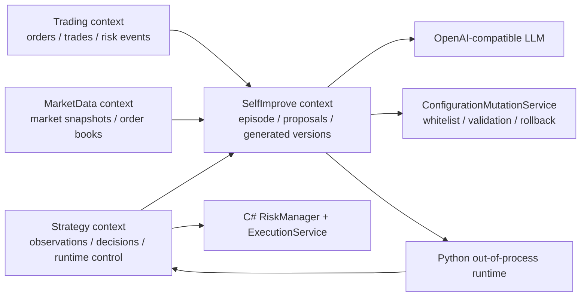
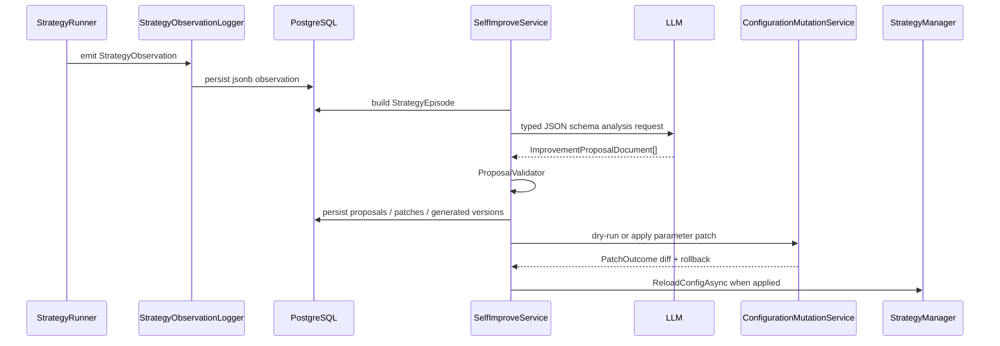
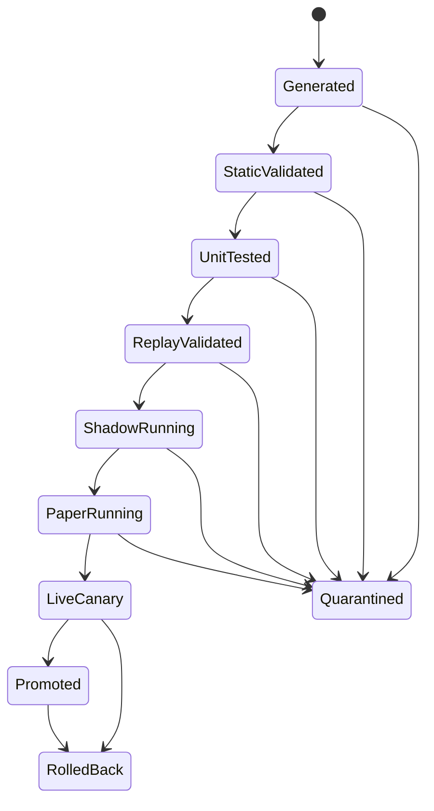

# SelfImprove 模块设计

本文档描述 Autotrade 的 `SelfImprove` bounded context。该模块不是在线训练模型权重，而是在交易系统之外建立系统级外循环：收集策略观测，构造 episode，调用 LLM 生成 typed proposal，经过校验后形成参数补丁或生成策略版本，并通过严格的晋级、回滚和隔离机制进入 Paper/Live canary。

---

## 1. 设计目标

SelfImprove 的目标是让自动交易系统具备可审计、可回滚、可门禁的持续改进能力。

核心原则：

- 不让 LLM 直接下单，也不让生成代码接触 API key、私钥或交易执行服务。
- 不依赖文本日志做策略诊断，策略热路径必须产生结构化观测。
- LLM 输出必须落到 typed artifact，不能把自由文本建议直接应用到运行系统。
- 参数补丁只允许修改白名单配置路径，必须先 dry-run、类型校验、配置校验和合规校验。
- 生成策略代码以 immutable artifact 形式保存，不覆盖源码。
- Live 自动化只允许进入 canary，不能直接替换主策略。

---

## 2. 模块边界

SelfImprove 位于 `context/SelfImprove`，依赖 Strategy、Trading、MarketData 的只读数据和 Strategy 的运行控制接口。它不拥有交易执行权。



SelfImprove 可以读取和分析：

- `StrategyDecisionLog`
- `StrategyObservationLog`
- order / trade / order event 数据
- risk event 数据
- strategy config version 和 execution mode

SelfImprove 可以产生：

- `ImprovementRun`
- `StrategyEpisode`
- `StrategyMemory`
- `ImprovementProposal`
- `ParameterPatch`
- `PatchOutcome`
- `GeneratedStrategyVersion`
- `PromotionGateResult`

SelfImprove 不能绕过：

- C# 风控
- C# 执行服务
- kill switch
- live arming gate
- 配置白名单
- generated strategy promotion gate

---

## 3. 项目结构

```text
context/SelfImprove/
  Autotrade.SelfImprove.Domain.Shared/
    Enums/
      GeneratedStrategyStage.cs
      ImprovementProposalStatus.cs
      ImprovementRunStatus.cs
      ImprovementRiskLevel.cs
      PatchOutcomeStatus.cs
      PromotionGateStage.cs
      ProposalKind.cs

  Autotrade.SelfImprove.Domain/
    Entities/
      ImprovementRun.cs
      StrategyEpisode.cs
      StrategyMemory.cs
      ImprovementProposal.cs
      ParameterPatch.cs
      PatchOutcome.cs
      GeneratedStrategyVersion.cs
      PromotionGateResult.cs

  Autotrade.SelfImprove.Application.Contract/
    SelfImproveContracts.cs
    Episodes/StrategyEpisodeContracts.cs
    Proposals/ImprovementProposalContracts.cs
    GeneratedStrategies/GeneratedStrategyContracts.cs
    Llm/LlmContracts.cs

  Autotrade.SelfImprove.Application/
    SelfImproveService.cs
    SelfImproveOptions.cs
    Episodes/StrategyEpisodeBuilder.cs
    Llm/OpenAiCompatibleLlmClient.cs
    Llm/DotEnvReader.cs
    Proposals/ProposalValidator.cs
    GeneratedStrategies/GeneratedStrategyPackageService.cs
    GeneratedStrategies/GeneratedStrategyRegistrationProvider.cs
    Python/OutOfProcessPythonStrategyRuntime.cs
    Python/PythonStrategyAdapter.cs
    Python/PythonStrategyWorkerScript.cs

  Autotrade.SelfImprove.Infra.Data/
    Context/SelfImproveContext.cs
    Repositories/SelfImproveRepositories.cs
    Migrations/20260504021920_InitialSelfImprove.cs

  Autotrade.SelfImprove.Infra.BackgroundJobs/
    Jobs/SelfImproveAnalysisJob.cs
    SelfImproveJobConfigurator.cs

  Autotrade.SelfImprove.Tests/
    Configuration/
    Llm/
    Proposals/
```

跨 context 支撑代码：

- `Shared/Autotrade.Application/Configuration/*`：配置变更服务、白名单、dry-run、rollback diff。
- `context/Strategy/.../Strategies/StrategyObservation.cs`：结构化策略观测 contract。
- `context/Strategy/.../Observations/*`：观测写入、抽样、聚合、查询。
- `interfaces/Autotrade.Api/Controllers/SelfImproveController.cs`：ControlRoom/API 入口。
- `Autotrade.Cli/Commands/SelfImproveCommands.cs`：CLI 入口。

---

## 4. 数据闭环

SelfImprove 采用在线系统外循环，不做模型权重更新。



闭环分为五层：

1. Observation loop：每次 select、entry、exit、order update、risk rejection、execution rejection、timeout 都写结构化观测。
2. Episode loop：按策略、市场、配置版本和时间窗口聚合决策、观测、订单、风控和 PnL 指标。
3. LLM proposal loop：LLM 只能输出 typed `ImprovementProposalDocument`，每条建议必须带 evidence。
4. Mutation loop：参数补丁通过共享配置变更服务执行，默认 dry-run。
5. Generated strategy loop：LLM 生成 Python 策略包，经过静态校验、测试、回放、shadow、paper、live canary 后才能晋级。

---

## 5. 策略观测

SelfImprove 的输入基础是 Strategy context 的结构化观测。

```csharp
public sealed record StrategyObservation(
    string StrategyId,
    string? MarketId,
    string Phase,
    string Outcome,
    string ReasonCode,
    string? FeaturesJson,
    string? StateJson,
    string? CorrelationId,
    string ConfigVersion,
    string? ExecutionMode,
    DateTimeOffset TimestampUtc);
```

观测写入 `StrategyObservationLogs`，核心字段包括：

- `StrategyId`
- `MarketId`
- `Phase`
- `Outcome`
- `ReasonCode`
- `FeaturesJson`
- `StateJson`
- `CorrelationId`
- `ConfigVersion`
- `ExecutionMode`
- `CreatedAtUtc`

记录策略：

- 信号、拒单、异常、timeout、kill switch 阻断：全量记录。
- 普通 skip：按窗口聚合和抽样，避免热路径写入爆炸。
- 所有观测带 `ConfigVersion`，后续 episode 可以把表现和具体配置版本绑定。

观测不是 Serilog 文本日志的替代物，而是供 SelfImprove 和 replay 直接消费的结构化事实。

---

## 6. Episode 构造

`StrategyEpisodeBuilder` 按策略和时间窗口构造 `StrategyEpisode`。

输入请求：

```csharp
public sealed record BuildStrategyEpisodeRequest(
    string StrategyId,
    string? MarketId,
    DateTimeOffset WindowStartUtc,
    DateTimeOffset WindowEndUtc,
    int Limit = 5000);
```

Episode 输出指标：

- `DecisionCount`
- `ObservationCount`
- `OrderCount`
- `TradeCount`
- `RiskEventCount`
- `NetPnl`
- `FillRate`
- `RejectRate`
- `TimeoutRate`
- `MaxOpenExposure`
- `DrawdownLike`
- `SourceIdsJson`
- `MetricsJson`

Episode 的职责是把多个 context 的原始事实压缩成可审计、可引用的分析样本。LLM 不能只根据自然语言总结下结论，必须引用 episode 中的 evidence id。

---

## 7. LLM 接口

LLM 调用使用 OpenAI-compatible chat completions 风格，参考 GoodMemory 的实现习惯：

- 从 `.env` 或环境变量读取 API key。
- 通过配置指定 `BaseUrl`、`Model`、`ApiKeyEnvVar`、timeout 和 retries。
- 接收 JSON schema 约束。
- 自动剥离 `<think>` 块。
- 从模型回复中提取 JSON object。
- malformed JSON 或缺 evidence 的 proposal 不会自动应用。

LLM contract：

```csharp
public interface ILLmClient
{
    Task<IReadOnlyList<ImprovementProposalDocument>> AnalyzeEpisodeAsync(
        StrategyEpisodeAnalysisRequest request,
        CancellationToken cancellationToken = default);

    Task<GeneratedStrategySpec> GenerateStrategyAsync(
        ImprovementProposalDocument proposal,
        StrategyEpisodeDto episode,
        CancellationToken cancellationToken = default);
}
```

Proposal contract：

```csharp
public sealed record ImprovementProposalDocument(
    ProposalKind Kind,
    ImprovementRiskLevel RiskLevel,
    string Title,
    string Rationale,
    IReadOnlyList<EvidenceRef> Evidence,
    string ExpectedImpact,
    IReadOnlyList<string> RollbackConditions,
    IReadOnlyList<ParameterPatchSpec> ParameterPatches,
    GeneratedStrategySpec? GeneratedStrategy);
```

LLM 输出限制：

- `Evidence` 不能为空，否则进入 manual review。
- `RiskLevel` 必须明确。
- `RollbackConditions` 必须存在。
- 参数补丁必须是白名单路径。
- 生成策略必须包含 manifest、Python module、参数 schema、unit tests、replay spec、risk envelope。

---

## 8. 参数补丁

参数补丁不直接改源码，也不直接改任意配置路径。

执行流程：

1. `ImprovementProposal` 提供 `ParameterPatchSpec`。
2. `ProposalValidator` 检查 evidence、风险等级、回滚条件和 patch 基本合法性。
3. `ConfigurationMutationService` 执行 dry-run。
4. 检查路径白名单、类型、schema、Options validation 和 compliance guard。
5. 生成 `DiffJson` 和 `RollbackJson`。
6. 非 dry-run 且通过后写 override config。
7. stamp `ConfigVersion`。
8. 调用 `IStrategyManager.ReloadConfigAsync(strategyId)`。
9. 写入 `PatchOutcome`。

默认行为是 dry-run：

```text
autotrade self-improve apply --proposal-id <proposalId> --dry-run true
```

任何提高风险上限、修改密钥、修改合规配置、修改 `Execution:Mode`、绕过 kill switch 的补丁都应被拒绝。

---

## 9. 生成策略运行时

LLM 生成的新策略不进入 C# 源码树，也不在交易进程内执行任意 Python 代码。它被保存为 immutable strategy package，并通过 `PythonStrategyAdapter : ITradingStrategy` 接入 Strategy 注册表。

生成策略包包含：

- `manifest`
- Python strategy module
- parameter schema
- unit tests
- replay spec
- risk envelope
- package hash

Python runtime contract：

```csharp
public sealed record PythonStrategyRequest(
    string StrategyId,
    string Phase,
    string MarketId,
    object MarketSnapshot,
    IReadOnlyDictionary<string, object?> Params,
    DateTimeOffset TimestampUtc,
    IReadOnlyDictionary<string, object?> State);

public sealed record PythonStrategyResponse(
    string Action,
    string ReasonCode,
    string Reason,
    IReadOnlyList<PythonOrderIntent> Intents,
    IReadOnlyDictionary<string, object?> Telemetry,
    IReadOnlyDictionary<string, object?> StatePatch);
```

Python 只能返回：

- `skip`
- `enter`
- `exit`
- `cancel`
- `replace`

Python 不能：

- 读取 API key 或私钥。
- 调用 Polymarket API。
- 直接下单。
- 修改 live arming、kill switch 或 execution mode。
- 访问未脱敏的账户凭据。

所有订单 intent 必须回到 C# StrategyRunner，并继续经过 C# RiskManager 和 ExecutionService。

---

## 10. 策略注册

Strategy factory 改成动态注册表模型。注册来源包括：

- 现有 C# strategy registrations。
- SelfImprove 激活的 generated strategy manifests。

`GeneratedStrategyRegistrationProvider` 把通过门禁的 generated strategy 暴露为一等策略，而不是旁路执行器。这样 StrategyManager、run state、kill switch、paper/live 生命周期、观测、订单更新都继续走同一套主干。

---

## 11. 晋级状态机

生成策略版本状态：



规则：

- 禁止跳级。
- 每个 gate 写 `PromotionGateResult`。
- 任何阶段失败都保留 evidence。
- LiveCanary 需要 `SelfImprove:LiveAutoApplyEnabled=true`。
- 默认只允许一个 generated strategy 处于 active LiveCanary。
- LiveCanary 必须受单笔、单周期、总名义金额硬限额约束。
- 异常触发策略级 kill switch 后回滚或隔离。

---

## 12. 数据库表

SelfImprove 使用独立 EF Core context：`SelfImproveContext`。

迁移历史表：

```text
__EFMigrationsHistory_SelfImprove
```

业务表：

| 表 | 用途 |
| --- | --- |
| `ImprovementRuns` | 一次 self-improve 分析运行 |
| `StrategyEpisodes` | 聚合后的策略分析样本 |
| `StrategyMemories` | typed durable memory 和 improvement playbook |
| `ImprovementProposals` | LLM typed proposal |
| `ParameterPatches` | 参数补丁明细 |
| `PatchOutcomes` | 参数补丁 dry-run/apply 结果 |
| `GeneratedStrategyVersions` | 生成策略版本和 artifact 元数据 |
| `PromotionGateResults` | 生成策略晋级门禁结果 |

Strategy context 额外表：

| 表 | 用途 |
| --- | --- |
| `StrategyObservationLogs` | 策略结构化观测 |

---

## 13. API

SelfImprove API 前缀：

```text
/api/self-improve
```

接口：

| Method | Path | 说明 |
| --- | --- | --- |
| `GET` | `/api/self-improve/runs?limit=50` | 查询最近 runs |
| `GET` | `/api/self-improve/runs/{runId}` | 查询单次 run、episode、proposals |
| `POST` | `/api/self-improve/runs` | 构造 episode 并触发 LLM 分析 |
| `POST` | `/api/self-improve/proposals/{proposalId}/apply?dryRun=true` | dry-run 或应用参数补丁 |
| `POST` | `/api/self-improve/generated/{generatedVersionId}/promote?stage=...` | 晋级 generated strategy |
| `POST` | `/api/self-improve/generated/{generatedVersionId}/rollback` | 回滚 generated strategy |
| `POST` | `/api/self-improve/generated/{generatedVersionId}/quarantine` | 隔离 generated strategy |

Swagger：

```text
http://localhost:5080/swagger/index.html
```

---

## 14. CLI

CLI 入口：

```text
autotrade self-improve run
autotrade self-improve list
autotrade self-improve show
autotrade self-improve apply
autotrade self-improve promote
autotrade self-improve rollback
autotrade self-improve quarantine
```

典型流程：

```text
autotrade self-improve run --strategy-id <strategyId> --window-minutes 120
autotrade self-improve list --limit 20
autotrade self-improve show --run-id <runId>
autotrade self-improve apply --proposal-id <proposalId> --dry-run true
autotrade self-improve apply --proposal-id <proposalId> --dry-run false
autotrade self-improve promote --generated-version-id <id> --stage PaperRunning
autotrade self-improve promote --generated-version-id <id> --stage LiveCanary
autotrade self-improve rollback --generated-version-id <id>
autotrade self-improve quarantine --generated-version-id <id> --reason "failed replay gate"
```

---

## 15. 配置

默认配置应保持关闭。

```json
{
  "SelfImprove": {
    "Enabled": false,
    "LiveAutoApplyEnabled": false,
    "ArtifactRoot": "artifacts/self-improve",
    "Llm": {
      "Provider": "OpenAICompatible",
      "Model": "gpt-4.1-mini",
      "BaseUrl": null,
      "ApiKeyEnvVar": "OPENAI_API_KEY",
      "TimeoutSeconds": 120,
      "MaxRetries": 3
    },
    "CodeGen": {
      "Enabled": true,
      "PythonExecutable": "python",
      "WorkerTimeoutSeconds": 5
    },
    "Canary": {
      "MaxActiveLiveCanaries": 1,
      "MaxSingleOrderNotional": 5,
      "MaxCycleNotional": 20,
      "MaxTotalNotional": 100
    }
  }
}
```

API key 来源：

- `.env`
- 环境变量
- 变量名由 `SelfImprove:Llm:ApiKeyEnvVar` 指定

不要把真实 API key、私钥或交易凭据写入 appsettings 或源码。

---

## 16. Background Jobs

SelfImprove Hangfire jobs 用于周期性分析和复盘。

职责：

- 按配置定时触发 `SelfImproveAnalysisJob`。
- 从近期策略窗口构造 episode。
- 运行 LLM 分析。
- 保留 run、proposal、gate evidence。
- 在 retention 前保留高价值 summary。

后台任务不应阻塞交易热路径。交易循环只负责记录观测，分析、生成、校验、晋级都在外循环中进行。

---

## 17. 安全与合规

SelfImprove 的安全边界是模块设计的一部分，不是后续补丁。

强制约束：

- LLM 不接触交易密钥。
- Python worker 不继承敏感环境变量。
- Python worker 超时、崩溃、invalid JSON 均返回失败，不继续交易。
- generated package 必须校验 hash。
- proposal 无 evidence 进入 manual review。
- 参数补丁必须 whitelist。
- LiveCanary 必须显式启用。
- 默认只允许一个 active LiveCanary。
- 任一阶段失败后不能跳级。
- 回滚条件必须随 proposal 一起保存。

---

## 18. 测试策略

已覆盖的测试方向：

- proposal validation
- malformed LLM JSON
- `<think>` 块剥离
- unsafe config path
- configuration mutation dry-run / apply

后续扩展测试应覆盖：

- observation sampling / aggregation
- episode KPI correctness
- generated package 缺文件、hash 不匹配、风险 envelope 无效
- Python worker timeout、crash restart、invalid JSON
- no-secret environment
- replay determinism
- shadow 和 paper gate
- LiveCanary rollback
- Hangfire job idempotency
- API/CLI apply/promote/rollback/quarantine

基础验证命令：

```text
dotnet build --no-restore
dotnet test --no-build
```

浏览器/API smoke：

```text
GET http://localhost:5080/swagger/index.html
GET http://localhost:5080/api/self-improve/runs?limit=5
```

---

## 19. 当前实现状态

当前实现已经具备：

- SelfImprove bounded context。
- EF Core context、repositories、migration。
- Strategy observation contract、logger、repository、migration。
- Episode builder。
- OpenAI-compatible LLM client。
- Proposal validator。
- Configuration mutation service。
- Generated strategy package service。
- Python out-of-process runtime adapter。
- Dynamic generated strategy registration provider。
- API controller。
- CLI commands。
- Hangfire job registration。
- 配置默认值。
- SelfImprove 单元测试。

尚需在真实运行环境持续验证的部分：

- 真实 LLM 调用的成本、延迟和失败率。
- 长窗口 episode 对数据库查询压力的影响。
- 生成策略回放和 shadow 指标阈值。
- LiveCanary 的实盘风控阈值是否足够保守。

---

## 20. 操作建议

推荐上线顺序：

1. 保持 `SelfImprove:Enabled=false`，只开启 strategy observation。
2. 观察 `StrategyObservationLogs` 写入量和索引表现。
3. 在 Paper 环境开启 `SelfImprove:Enabled=true`。
4. 只运行 `self-improve run/list/show`，不 apply。
5. 对低风险 proposal 运行 dry-run。
6. 人工审核后应用参数补丁。
7. 生成策略只允许到 `StaticValidated` 和 `ReplayValidated`。
8. Paper 环境验证 generated strategy。
9. 明确配置 `LiveAutoApplyEnabled=true` 后，才允许单个 generated strategy 进入 LiveCanary。

生产环境默认禁止任何直接 Live 自动替换。
